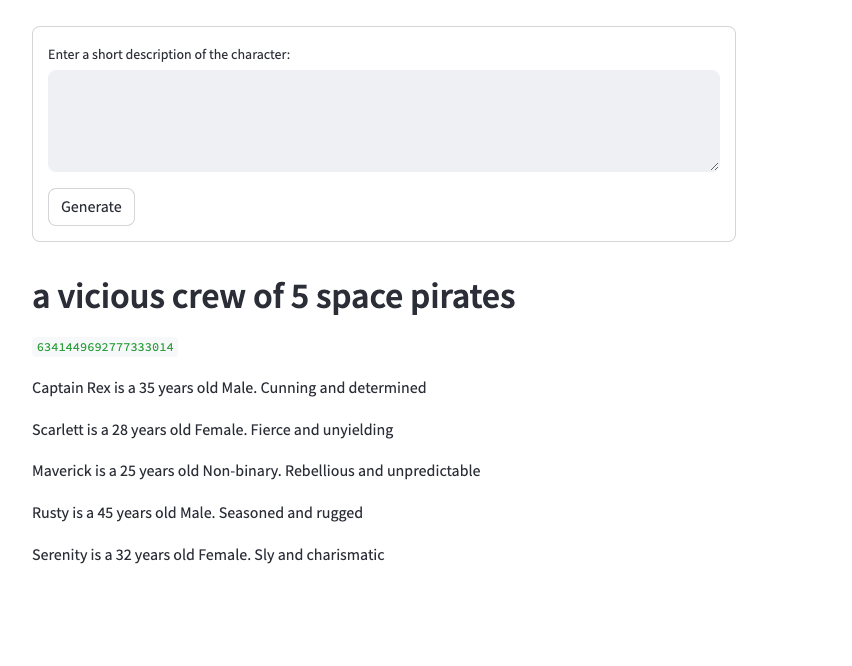

# CharacterGenerator

This is a short project showing how to using LLM function calls with a very short description to generate characters.

Try it at:

https://charactergenerator-rvvq6yy8l42uad77j4vzlq.streamlit.app/

